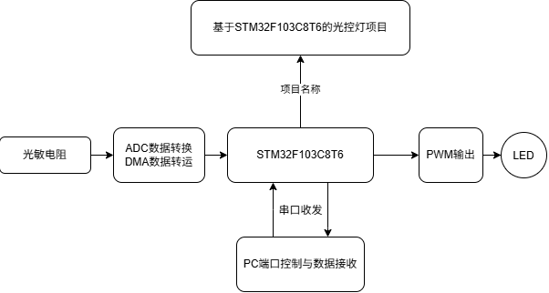

# STM32 Light Control Lamp

基于 STM32F103C8T6 的光控灯。光敏电阻采集环境光照，ADC + DMA 后台搬运数据，
MCU 按光照强度计算 PWM 占空比驱动 LED；同时通过串口与 PC 双向通信，
支持自动光控与 PC 远程控制两种模式。

> 项目来源于学习 STM32 标准外设库过程中的延伸实践。**当前仍在开发中。**

> 📘 **想搞懂每一步为什么这么选？** 打开
> [`docs/walkthrough.html`](docs/walkthrough.html) —— 一份交互式的实现路线复盘：
> 定时器 / ADC 通道 / 串口的选型判据、分步实现时间线、踩过的 7 个坑、
> 参数计算器与自测题。用浏览器直接打开即可，无需联网。

## 功能

- **自动模式**：光照越暗，LED 越亮，亮度按 10 ms 一步平滑渐变
- **PC 控制模式**：亮度只由串口指令决定，此时忽略光敏数据
- **串口看门狗**：PC 控制模式下 3 秒收不到指令，自动切回自动模式，防止失控
- **状态上报**：每 200 ms 输出一次 ADC 原始值、当前占空比与工作模式
- **OLED 本地显示**：每 500 ms 刷新光照值、占空比与当前模式
- ADC + DMA 循环采集，CPU 不参与搬运数据

## 硬件

| 器件 | 说明 |
|---|---|
| 主控 | STM32F103C8T6 最小系统板（LQFP48，Cortex-M3 @72 MHz，64 KB Flash / 20 KB SRAM） |
| 光敏元件 | 光敏电阻模块（用 AO 模拟输出接 ADC） |
| 执行器 | LED + 限流电阻（220 Ω ~ 1 kΩ） |
| 显示 | 0.96" OLED，SSD1306，软件 I2C |
| 通信 | USB-TTL 串口模块（CH340 / CP2102） |
| 调试 | ST-Link / DAP-Link，SWD 接口 |

## 引脚分配

| 引脚 | 复用功能 | 连接对象 | 备注 |
|---|---|---|---|
| PA0 | ADC1_IN0 | 光敏电阻模块 AO | 模拟输入 |
| PA1 | TIM2_CH2 | LED（阳极侧，串限流电阻） | PWM 输出，1 kHz / 1000 级 |
| PA9 | USART1_TX | USB-TTL 的 RXD | 交叉连接 |
| PA10 | USART1_RX | USB-TTL 的 TXD | 交叉连接 |
| PA13 | SWDIO | 调试器 | **保留，勿作普通 IO** |
| PA14 | SWCLK | 调试器 | **保留，勿作普通 IO** |
| PB1 | GPIO 输入 | 按键 1 | 上拉输入，**未启用**（`Key_Init()` 未调用） |
| PB6 | GPIO 输出 | OLED SCL | 软件 I2C，开漏输出 |
| PB7 | GPIO 输出 | OLED SDA | 软件 I2C，开漏输出 |
| PB11 | GPIO 输入 | 按键 2 | 上拉输入，**未启用**（同上） |
| PB13 | GPIO 输入 | 光敏模块 DO | 已初始化，读值未被使用，可不接 |
| PC13 | GPIO 输出 | 板载 LED | 低电平点亮，心跳指示 |

> 完整的 48 脚占用总览（含空闲引脚可用于什么）见
> [`docs/hardware.md`](docs/hardware.md#全引脚占用总览lqfp4848-脚全列)。

详细接线与电路说明见 [`docs/hardware.md`](docs/hardware.md)。

## 系统结构



```
光敏电阻 ──▶ ADC 采样 + DMA 搬运 ──▶ STM32F103C8T6 ──▶ PWM 输出 ──▶ LED
                                          ▲  │
                                          │  ▼
                                  PC 端控制与数据接收（串口）
```

## 软件架构

前后台系统。中断和 DMA 只做最少的事，全部耗时逻辑放在主循环里轮询执行。

| 层 | 目录 | 内容 |
|---|---|---|
| 应用层 | `User/` | `App.c` 状态机、任务调度、命令分发；`main.c` 入口 |
| 器件层 | `Hardware/` | 光敏、调光、串口、OLED、按键、板载 LED |
| 驱动层 | `System/` | ADC + DMA、PWM、系统节拍、延时 |
| 库 | `Library/` `Start/` | ST 标准外设库与 CMSIS 启动代码 |

时基与任务节拍：

| 任务 | 周期 | 位置 |
|---|---|---|
| 串口命令解析 | 事件驱动 | 主循环 |
| ADC 采样 | 连续，DMA 后台 | 硬件 |
| LED 渐变 | 10 ms | 主循环 |
| 状态上报 | 200 ms | 主循环 |
| OLED 刷新 | 500 ms | 主循环 |
| 心跳指示 | 500 ms | 主循环 |

## 目录结构

```text
stm32-light-control-lamp/
├── README.md
├── LICENSE
├── .gitignore
├── .gitattributes
├── Project.uvprojx              # Keil MDK 工程文件
├── keilkill.bat                 # 清理编译中间产物
├── docs/
│   ├── hardware.md              # 引脚分配、接线、电路原理
│   ├── protocol.md              # 串口通信协议
│   ├── build-guide.md           # 上手步骤与调试排查
│   ├── notes/                   # 开发笔记与调试日志
│   └── assets/                  # 框图与图片
├── User/                        # 应用层
│   ├── App.c / App.h
│   ├── main.c
│   └── stm32f10x_it.c / .h
├── Hardware/                    # 器件驱动
│   ├── LightSensor.c / .h
│   ├── CtLED.c / .h
│   ├── Serial.c / .h
│   ├── OLED.c / .h / OLED_Font.h
│   ├── Key.c / .h
│   └── LED.c / .h
├── System/                      # 底层驱动
│   ├── AD.c / .h
│   ├── DMA.c / .h
│   ├── PWM.c / .h
│   ├── Timer.c / .h
│   └── Delay.c / .h
├── Library/                     # ST 标准外设库
└── Start/                       # CMSIS 与启动文件
```

## 编译与烧录

1. 用 **Keil MDK 5** 打开 `Project.uvprojx`
2. 确认目标器件为 `STM32F103C8`，编译器为 ARM Compiler 5（AC5）
3. 确认 `Options for Target -> C/C++ -> Define` 为
   `USE_STDPERIPH_DRIVER,STM32F10X_MD` —— 少了 `STM32F10X_MD` 会报
   `#error: Please select first the target STM32F10x device`
4. `Project -> Build Target`（F7）编译
5. **首次打开必须先设置下载器**（见下方提示），再用 ST-Link 连接 SWD，`Download`（F8）烧录
6. `BOOT0` 跳线接地，从 Flash 启动

> ⚠️ **第一次打开工程必做的一步**：Keil 新建/重建工程配置时，默认调试器是
> **ULINK2/ME**，直接点下载会报 `No ULINK2/ME Device found`。
> 打开 `Options for Target -> Debug`，在右上角下拉框里选 **ST-Link Debugger**，
> 点 `Settings` 确认 `Port = SW`，再确定即可。设置会保存在 `Project.uvoptx` 里，
> 之后就不用再动。详见 [`docs/build-guide.md`](docs/build-guide.md)。

**资源占用**（AC5 -O1 全量编译链接实测）：

| 区域 | 用量 | 芯片容量 | 占比 |
|---|---|---|---|
| Flash（Code + RO Data） | 20.24 KB | 64 KB | 31.7% |
| RAM（RW + ZI Data） | 1.30 KB | 20 KB | 6.5% |

详细步骤、接线顺序和常见问题见 [`docs/build-guide.md`](docs/build-guide.md)。

## 串口命令

115200 8-N-1，ASCII 文本行，以 `\r\n` 结尾。发送大写、小写均可。

| 命令 | 说明 |
|---|---|
| `LIGHT 60` | 设定亮度 0~100%，并切换到 PC 控制模式 |
| `MODE AUTO` / `MODE PC` | 切换工作模式 |
| `QUERY` | 查询当前状态 |
| `HELP` | 列出所有命令 |

MCU 每 200 ms 上报一次：

```
DATA adc=1873 duty=42 target=42 mode=AUTO
```

完整协议见 [`docs/protocol.md`](docs/protocol.md)。

## 开发进度

- [x] 工程搭建、OLED 显示、串口收发
- [x] ADC + DMA 循环采集
- [x] TIM2 PWM 输出，1000 级分辨率
- [x] 非阻塞渐变调光
- [x] 自动 / PC 双模式状态机
- [x] 串口命令行与状态上报
- [x] 串口看门狗超时保护
- [ ] 按键手动调光
- [ ] 光照阈值与映射曲线可配置并保存到 Flash

## 已知问题

- `Key.c` 的消抖使用了阻塞延时，按下按键期间会短暂影响其他任务。
  后续改为基于时间戳的非阻塞消抖。

## 参考资料

- RM0008《STM32F10xxx 参考手册》—— ST 官方文档，请从 [ST 官网](https://www.st.com/) 获取，本仓库不随附
- 《STM32F103x8/xB 数据手册》—— 引脚定义与电气参数以此为准
- STM32 标准外设库 V3.5.0

## License

待确定。
